# System and Program Design

---

<div align="center">

# McFramework
## Monte Carlo Simulation Framework

### System and Program Design Document

---

**Course:** Software Engineering

**Team Members:**

| Name | Section | Email |
|:----:|:-------:|:-----:|
| Milan Fusco | 11:00 AM | mdfusco@student.ysu.edu |
| James Gabbert | 11:00 AM | jdgabbert@student.ysu.edu |

---

**Date:** December 2024

</div>

---

## Table of Contents

1. [System Overview](#1-system-overview)
2. [Architectural Design](#2-architectural-design)
3. [Architectural Views](#3-architectural-views)
4. [Design Patterns](#4-design-patterns)
5. [UML Diagrams](#5-uml-diagrams)
6. [Module Descriptions](#6-module-descriptions)
7. [Data Flow](#7-data-flow)
8. [Interface Design](#8-interface-design)

---

## 1. System Overview

### 1.1 Purpose

McFramework is a Python library providing a robust, extensible foundation for building and running Monte Carlo simulations with rigorous statistical analysis. The framework enables researchers, students, and quantitative analysts to conduct reproducible computational experiments.

### 1.2 Scope

The system provides:

- Abstract base class for custom simulation development
- Deterministic parallel execution with reproducible RNG streams
- Comprehensive statistics engine with multiple confidence interval methods
- Built-in simulations for common use cases

### 1.3 System Context Diagram

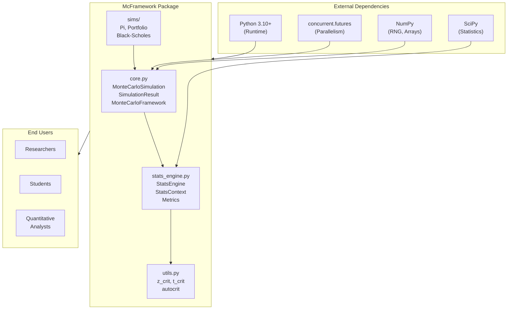
```mermaid
flowchart TB
    subgraph External["External Dependencies"]
        numpy["NumPy<br/>(RNG, Arrays)"]
        scipy["SciPy<br/>(Statistics)"]
        python["Python 3.10+<br/>(Runtime)"]
        concurrent["concurrent.futures<br/>(Parallelism)"]
    end

    subgraph McFramework["McFramework Package"]
        core["core.py<br/>MonteCarloSimulation<br/>SimulationResult<br/>MonteCarloFramework"]
        stats["stats_engine.py<br/>StatsEngine<br/>StatsContext<br/>Metrics"]
        utils["utils.py<br/>z_crit, t_crit<br/>autocrit"]
        sims["sims/<br/>Pi, Portfolio<br/>Black-Scholes"]
    end

    subgraph Users["End Users"]
        researchers["Researchers"]
        students["Students"]
        quants["Quantitative<br/>Analysts"]
    end

    numpy --> core
    scipy --> stats
    python --> McFramework
    concurrent --> core

    core --> stats
    stats --> utils
    sims --> core

    McFramework --> Users
```

---

## 2. Architectural Design

### 2.1 Architectural Style

McFramework follows a **Layered Architecture** combined with **Plugin Architecture** principles:

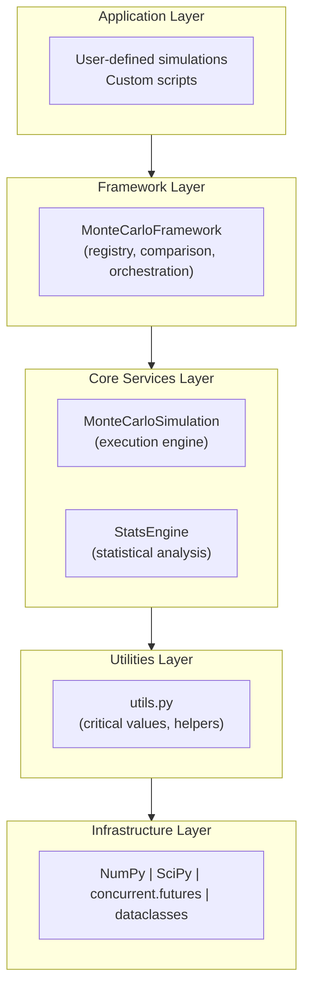
```mermaid
flowchart TB
    subgraph Layer5["Application Layer"]
        user["User-defined simulations<br/>Custom scripts"]
    end

    subgraph Layer4["Framework Layer"]
        framework["MonteCarloFramework<br/>(registry, comparison, orchestration)"]
    end

    subgraph Layer3["Core Services Layer"]
        sim["MonteCarloSimulation<br/>(execution engine)"]
        engine["StatsEngine<br/>(statistical analysis)"]
    end

    subgraph Layer2["Utilities Layer"]
        utils2["utils.py<br/>(critical values, helpers)"]
    end

    subgraph Layer1["Infrastructure Layer"]
        infra["NumPy | SciPy | concurrent.futures | dataclasses"]
    end

    Layer5 --> Layer4
    Layer4 --> Layer3
    Layer3 --> Layer2
    Layer2 --> Layer1
```

### 2.2 Component Diagram


```mermaid
flowchart TB
    subgraph mcframework["mcframework package"]
        subgraph core_comp["<<component>><br/>core"]
            MCS["MonteCarloSimulation<br/><<abstract>>"]
            SR["SimulationResult<br/><<dataclass>>"]
            MCF["MonteCarloFramework"]
        end

        subgraph stats_comp["<<component>><br/>stats_engine"]
            SE["StatsEngine"]
            SC["StatsContext<br/><<dataclass>>"]
            CR["ComputeResult<br/><<dataclass>>"]
            FM["FnMetric<br/><<generic>>"]
            MP["Metric<br/><<protocol>>"]
        end

        subgraph utils_comp["<<component>><br/>utils"]
            zcrit["z_crit()"]
            tcrit["t_crit()"]
            auto["autocrit()"]
        end

        subgraph sims_comp["<<component>><br/>sims"]
            pi["PiEstimationSimulation"]
            port["PortfolioSimulation"]
            bs["BlackScholesSimulation"]
            bsp["BlackScholesPathSimulation"]
        end
    end

    core_comp -->|uses| stats_comp
    core_comp -->|uses| utils_comp
    stats_comp -->|uses| utils_comp
    sims_comp -->|extends| core_comp
```

---

## 3. Architectural Views

### 3.1 Logical View

The logical view shows the key abstractions and their relationships:

| Abstraction | Responsibility | Collaborators |
|-------------|----------------|---------------|
| `MonteCarloSimulation` | Define simulation behavior, manage RNG, execute runs | `StatsEngine`, `SimulationResult` |
| `SimulationResult` | Store outputs, provide formatted summaries | None (data container) |
| `MonteCarloFramework` | Registry, orchestration, comparison | `MonteCarloSimulation`, `SimulationResult` |
| `StatsEngine` | Evaluate metrics, handle errors | `Metric`, `StatsContext`, `ComputeResult` |
| `StatsContext` | Configure statistical computations | None (configuration) |

### 3.2 Process View

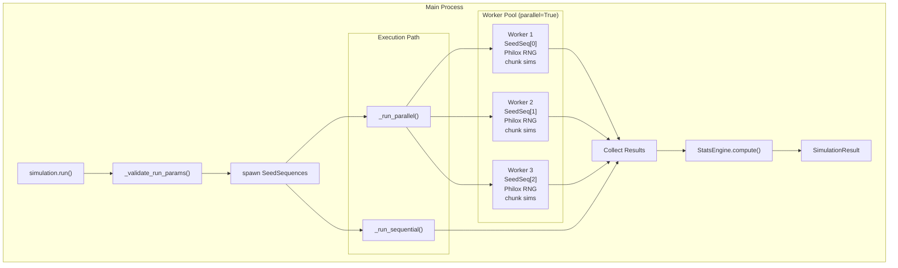
```mermaid
flowchart TB
    subgraph Main["Main Process"]
        run["simulation.run()"]
        validate["_validate_run_params()"]
        seed["spawn SeedSequences"]
        
        subgraph Execution["Execution Path"]
            seq["_run_sequential()"]
            par["_run_parallel()"]
        end
        
        subgraph Workers["Worker Pool (parallel=True)"]
            w1["Worker 1<br/>SeedSeq[0]<br/>Philox RNG<br/>chunk sims"]
            w2["Worker 2<br/>SeedSeq[1]<br/>Philox RNG<br/>chunk sims"]
            w3["Worker 3<br/>SeedSeq[2]<br/>Philox RNG<br/>chunk sims"]
        end
        
        collect["Collect Results"]
        stats["StatsEngine.compute()"]
        result["SimulationResult"]
    end

    run --> validate
    validate --> seed
    seed --> seq
    seed --> par
    par --> w1 & w2 & w3
    w1 & w2 & w3 --> collect
    seq --> collect
    collect --> stats
    stats --> result
```

### 3.3 Development View

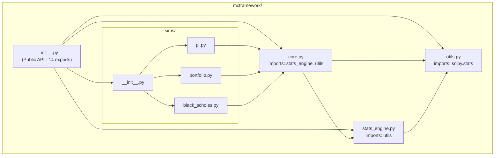
```mermaid
flowchart TB
    subgraph Package["mcframework/"]
        init["__init__.py<br/>(Public API - 14 exports)"]
        
        core["core.py<br/>imports: stats_engine, utils"]
        
        stats["stats_engine.py<br/>imports: utils"]
        
        utils["utils.py<br/>imports: scipy.stats"]
        
        subgraph sims["sims/"]
            sims_init["__init__.py"]
            pi["pi.py"]
            portfolio["portfolio.py"]
            black_scholes["black_scholes.py"]
        end
    end

    init --> core
    init --> stats
    init --> utils
    init --> sims_init

    core --> stats
    core --> utils
    stats --> utils

    sims_init --> pi & portfolio & black_scholes
    pi & portfolio & black_scholes --> core
```

### 3.4 Physical View (Deployment)

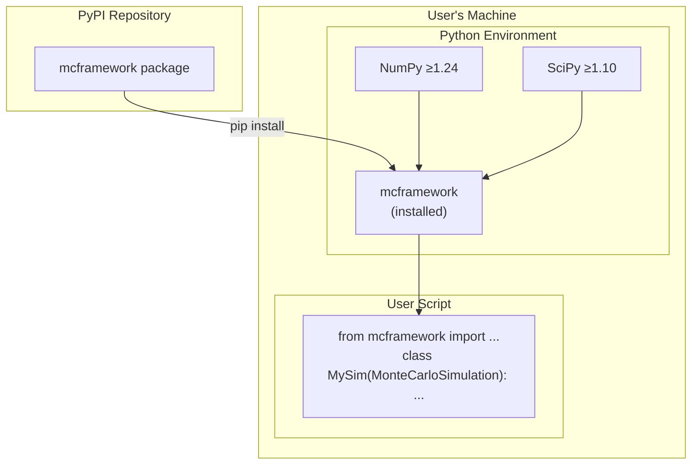
```mermaid
flowchart TB
    subgraph PyPI["PyPI Repository"]
        pkg["mcframework package"]
    end

    subgraph UserMachine["User's Machine"]
        subgraph PythonEnv["Python Environment"]
            numpy["NumPy ≥1.24"]
            scipy["SciPy ≥1.10"]
            mcf["mcframework<br/>(installed)"]
        end

        subgraph UserCode["User Script"]
            script["from mcframework import ...<br/>class MySim(MonteCarloSimulation): ..."]
        end
    end

    pkg -->|pip install| mcf
    numpy & scipy --> mcf
    mcf --> script
```

---

## 4. Design Patterns

### 4.1 Template Method Pattern

**Location:** `MonteCarloSimulation.run()`

**Purpose:** Define the skeleton of the simulation algorithm, deferring specific steps to subclasses.

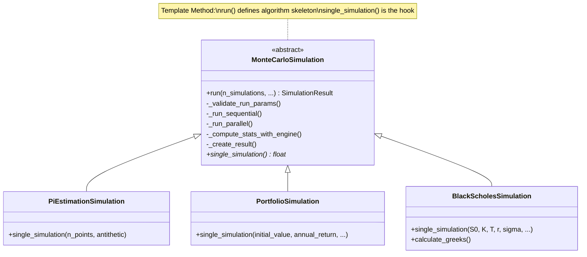
```mermaid
classDiagram
    class MonteCarloSimulation {
        <<abstract>>
        +run(n_simulations, ...) SimulationResult
        -_validate_run_params()
        -_run_sequential()
        -_run_parallel()
        -_compute_stats_with_engine()
        -_create_result()
        +single_simulation()* float
    }

    class PiEstimationSimulation {
        +single_simulation(n_points, antithetic)
    }

    class PortfolioSimulation {
        +single_simulation(initial_value, annual_return, ...)
    }

    class BlackScholesSimulation {
        +single_simulation(S0, K, T, r, sigma, ...)
        +calculate_greeks()
    }

    MonteCarloSimulation <|-- PiEstimationSimulation
    MonteCarloSimulation <|-- PortfolioSimulation
    MonteCarloSimulation <|-- BlackScholesSimulation

    note for MonteCarloSimulation "Template Method:\nrun() defines algorithm skeleton\nsingle_simulation() is the hook"
```

### 4.2 Strategy Pattern

**Location:** `StatsEngine` with `Metric` protocol

**Purpose:** Define a family of algorithms (metrics), encapsulate each one, and make them interchangeable.

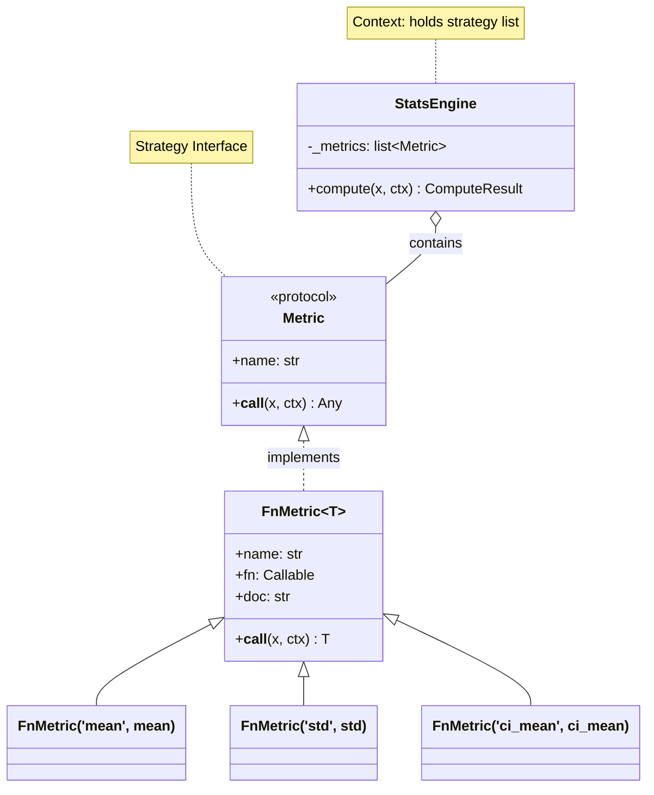
```mermaid
classDiagram
    class StatsEngine {
        -_metrics: list~Metric~
        +compute(x, ctx) ComputeResult
    }

    class Metric {
        <<protocol>>
        +name: str
        +__call__(x, ctx) Any
    }

    class FnMetric~T~ {
        +name: str
        +fn: Callable
        +doc: str
        +__call__(x, ctx) T
    }

    class mean_metric["FnMetric('mean', mean)"]
    class std_metric["FnMetric('std', std)"]
    class ci_metric["FnMetric('ci_mean', ci_mean)"]

    StatsEngine o-- Metric : contains
    Metric <|.. FnMetric : implements
    FnMetric <|-- mean_metric
    FnMetric <|-- std_metric
    FnMetric <|-- ci_metric

    note for StatsEngine "Context: holds strategy list"
    note for Metric "Strategy Interface"
```

### 4.3 Registry Pattern

**Location:** `MonteCarloFramework`

**Purpose:** Maintain a collection of named simulations for lookup and comparison.

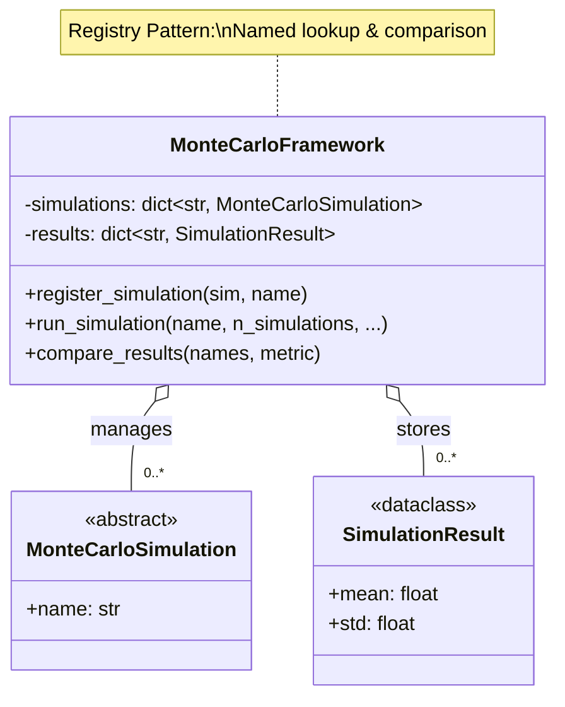
```mermaid
classDiagram
    class MonteCarloFramework {
        -simulations: dict~str, MonteCarloSimulation~
        -results: dict~str, SimulationResult~
        +register_simulation(sim, name)
        +run_simulation(name, n_simulations, ...)
        +compare_results(names, metric)
    }

    class MonteCarloSimulation {
        <<abstract>>
        +name: str
    }

    class SimulationResult {
        <<dataclass>>
        +mean: float
        +std: float
    }

    MonteCarloFramework o-- "0..*" MonteCarloSimulation : manages
    MonteCarloFramework o-- "0..*" SimulationResult : stores

    note for MonteCarloFramework "Registry Pattern:\nNamed lookup & comparison"
```

### 4.4 Adapter Pattern

**Location:** `FnMetric`

**Purpose:** Convert a plain function into an object implementing the `Metric` protocol.

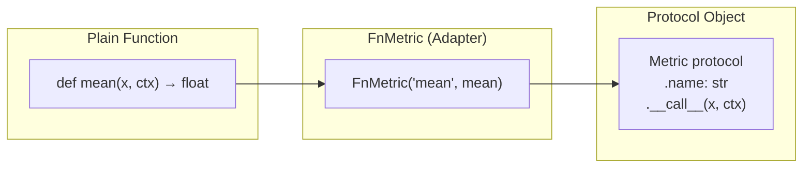
```mermaid
flowchart LR
    subgraph Before["Plain Function"]
        fn["def mean(x, ctx) → float"]
    end

    subgraph Adapter["FnMetric (Adapter)"]
        wrap["FnMetric('mean', mean)"]
    end

    subgraph After["Protocol Object"]
        metric["Metric protocol<br/>.name: str<br/>.__call__(x, ctx)"]
    end

    fn --> wrap
    wrap --> metric
```

### 4.5 Summary of Patterns

| Pattern | Location | Benefit |
|---------|----------|---------|
| **Template Method** | `MonteCarloSimulation.run()` | Reuse execution logic, customize only simulation |
| **Strategy** | `StatsEngine` + `Metric` | Pluggable metrics without changing engine |
| **Registry** | `MonteCarloFramework` | Named lookup and comparison |
| **Builder** | `StatsContext.with_overrides()` | Fluent configuration |
| **Adapter** | `FnMetric` | Convert functions to protocol objects |
| **Dataclass** | `SimulationResult`, `StatsContext`, `ComputeResult` | Immutable data containers |

---

## 5. UML Diagrams

### 5.1 Class Diagram (Core Module)

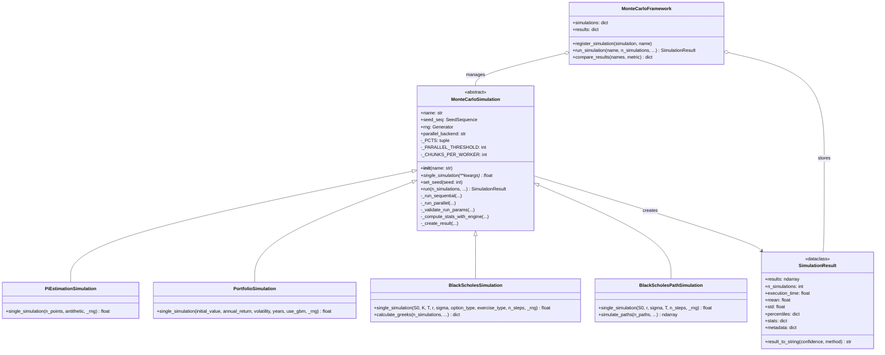
```mermaid
classDiagram
    class MonteCarloSimulation {
        <<abstract>>
        +name: str
        +seed_seq: SeedSequence
        +rng: Generator
        +parallel_backend: str
        -_PCTS: tuple
        -_PARALLEL_THRESHOLD: int
        -_CHUNKS_PER_WORKER: int
        +__init__(name: str)
        +single_simulation(**kwargs)* float
        +set_seed(seed: int)
        +run(n_simulations, ...) SimulationResult
        -_run_sequential(...)
        -_run_parallel(...)
        -_validate_run_params(...)
        -_compute_stats_with_engine(...)
        -_create_result(...)
    }

    class SimulationResult {
        <<dataclass>>
        +results: ndarray
        +n_simulations: int
        +execution_time: float
        +mean: float
        +std: float
        +percentiles: dict
        +stats: dict
        +metadata: dict
        +result_to_string(confidence, method) str
    }

    class MonteCarloFramework {
        +simulations: dict
        +results: dict
        +register_simulation(simulation, name)
        +run_simulation(name, n_simulations, ...) SimulationResult
        +compare_results(names, metric) dict
    }

    class PiEstimationSimulation {
        +single_simulation(n_points, antithetic, _rng) float
    }

    class PortfolioSimulation {
        +single_simulation(initial_value, annual_return, volatility, years, use_gbm, _rng) float
    }

    class BlackScholesSimulation {
        +single_simulation(S0, K, T, r, sigma, option_type, exercise_type, n_steps, _rng) float
        +calculate_greeks(n_simulations, ...) dict
    }

    class BlackScholesPathSimulation {
        +single_simulation(S0, r, sigma, T, n_steps, _rng) float
        +simulate_paths(n_paths, ...) ndarray
    }

    MonteCarloSimulation <|-- PiEstimationSimulation
    MonteCarloSimulation <|-- PortfolioSimulation
    MonteCarloSimulation <|-- BlackScholesSimulation
    MonteCarloSimulation <|-- BlackScholesPathSimulation

    MonteCarloSimulation --> SimulationResult : creates
    MonteCarloFramework o-- MonteCarloSimulation : manages
    MonteCarloFramework o-- SimulationResult : stores
```

### 5.2 Class Diagram (Stats Engine Module)

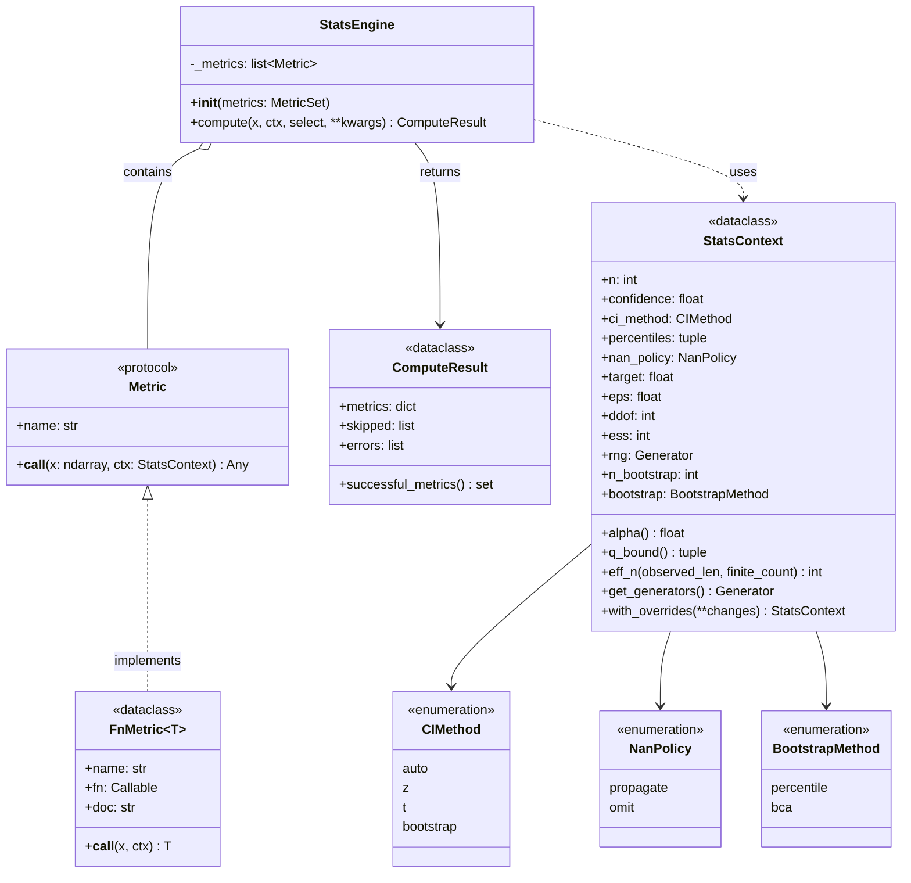
```mermaid
classDiagram
    class StatsContext {
        <<dataclass>>
        +n: int
        +confidence: float
        +ci_method: CIMethod
        +percentiles: tuple
        +nan_policy: NanPolicy
        +target: float
        +eps: float
        +ddof: int
        +ess: int
        +rng: Generator
        +n_bootstrap: int
        +bootstrap: BootstrapMethod
        +alpha() float
        +q_bound() tuple
        +eff_n(observed_len, finite_count) int
        +get_generators() Generator
        +with_overrides(**changes) StatsContext
    }

    class CIMethod {
        <<enumeration>>
        auto
        z
        t
        bootstrap
    }

    class NanPolicy {
        <<enumeration>>
        propagate
        omit
    }

    class BootstrapMethod {
        <<enumeration>>
        percentile
        bca
    }

    class StatsEngine {
        -_metrics: list~Metric~
        +__init__(metrics: MetricSet)
        +compute(x, ctx, select, **kwargs) ComputeResult
    }

    class ComputeResult {
        <<dataclass>>
        +metrics: dict
        +skipped: list
        +errors: list
        +successful_metrics() set
    }

    class Metric {
        <<protocol>>
        +name: str
        +__call__(x: ndarray, ctx: StatsContext) Any
    }

    class FnMetric~T~ {
        <<dataclass>>
        +name: str
        +fn: Callable
        +doc: str
        +__call__(x, ctx) T
    }

    StatsContext --> CIMethod
    StatsContext --> NanPolicy
    StatsContext --> BootstrapMethod

    StatsEngine o-- Metric : contains
    StatsEngine --> ComputeResult : returns
    StatsEngine ..> StatsContext : uses

    Metric <|.. FnMetric : implements
```

### 5.3 Sequence Diagram: Running a Simulation

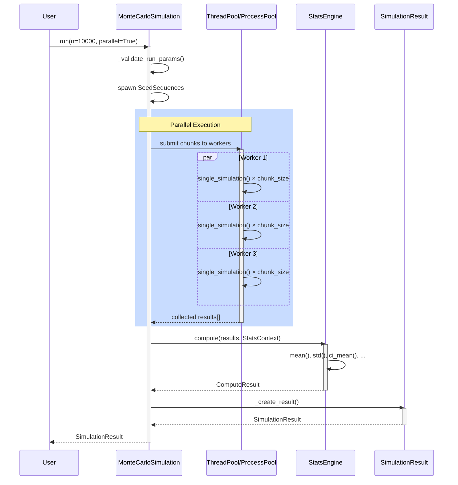
```mermaid
sequenceDiagram
    participant User
    participant Sim as MonteCarloSimulation
    participant Pool as ThreadPool/ProcessPool
    participant Engine as StatsEngine
    participant Result as SimulationResult

    User->>Sim: run(n=10000, parallel=True)
    activate Sim

    Sim->>Sim: _validate_run_params()
    Sim->>Sim: spawn SeedSequences

    rect rgb(200, 220, 255)
        Note over Sim,Pool: Parallel Execution
        Sim->>Pool: submit chunks to workers
        activate Pool

        par Worker 1
            Pool->>Pool: single_simulation() × chunk_size
        and Worker 2
            Pool->>Pool: single_simulation() × chunk_size
        and Worker 3
            Pool->>Pool: single_simulation() × chunk_size
        end

        Pool-->>Sim: collected results[]
        deactivate Pool
    end

    Sim->>Engine: compute(results, StatsContext)
    activate Engine
    Engine->>Engine: mean(), std(), ci_mean(), ...
    Engine-->>Sim: ComputeResult
    deactivate Engine

    Sim->>Result: _create_result()
    activate Result
    Result-->>Sim: SimulationResult
    deactivate Result

    Sim-->>User: SimulationResult
    deactivate Sim
```

### 5.4 Sequence Diagram: Bootstrap Confidence Interval

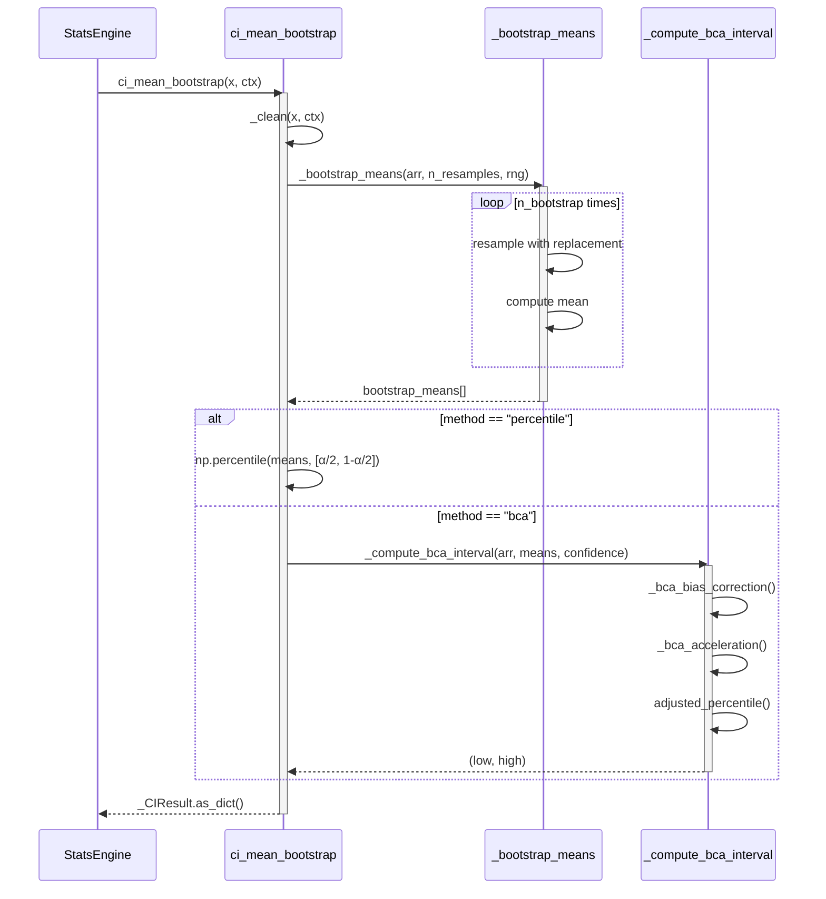
```mermaid
sequenceDiagram
    participant Engine as StatsEngine
    participant Bootstrap as ci_mean_bootstrap
    participant Means as _bootstrap_means
    participant BCa as _compute_bca_interval

    Engine->>Bootstrap: ci_mean_bootstrap(x, ctx)
    activate Bootstrap

    Bootstrap->>Bootstrap: _clean(x, ctx)
    
    Bootstrap->>Means: _bootstrap_means(arr, n_resamples, rng)
    activate Means
    
    loop n_bootstrap times
        Means->>Means: resample with replacement
        Means->>Means: compute mean
    end
    
    Means-->>Bootstrap: bootstrap_means[]
    deactivate Means

    alt method == "percentile"
        Bootstrap->>Bootstrap: np.percentile(means, [α/2, 1-α/2])
    else method == "bca"
        Bootstrap->>BCa: _compute_bca_interval(arr, means, confidence)
        activate BCa
        BCa->>BCa: _bca_bias_correction()
        BCa->>BCa: _bca_acceleration()
        BCa->>BCa: adjusted_percentile()
        BCa-->>Bootstrap: (low, high)
        deactivate BCa
    end

    Bootstrap-->>Engine: _CIResult.as_dict()
    deactivate Bootstrap
```

### 5.5 State Diagram: Simulation Lifecycle

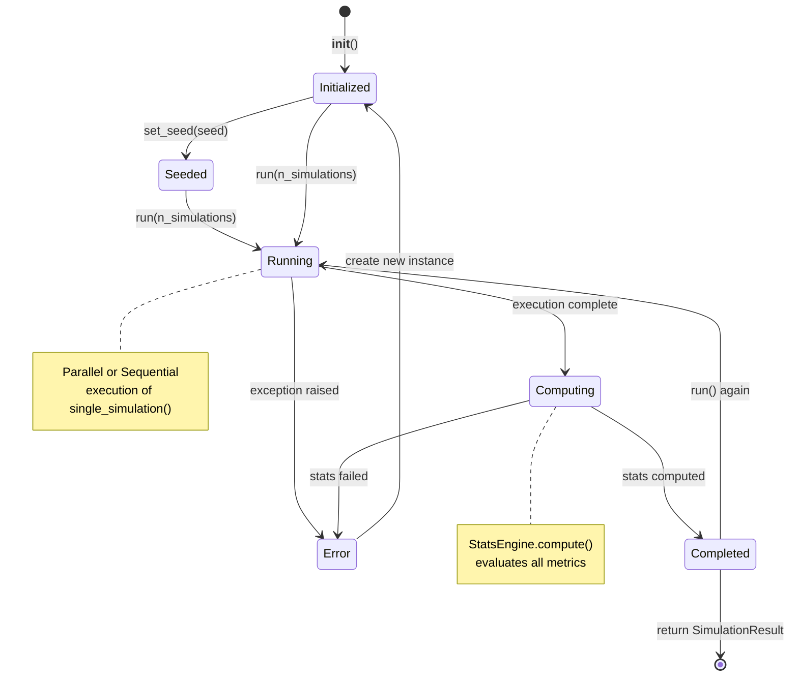
```mermaid
stateDiagram-v2
    [*] --> Initialized: __init__()

    Initialized --> Seeded: set_seed(seed)
    
    Seeded --> Running: run(n_simulations)
    Initialized --> Running: run(n_simulations)
    
    Running --> Computing: execution complete
    Running --> Error: exception raised
    
    Computing --> Completed: stats computed
    Computing --> Error: stats failed
    
    Error --> Initialized: create new instance
    
    Completed --> Running: run() again
    Completed --> [*]: return SimulationResult

    note right of Running
        Parallel or Sequential
        execution of single_simulation()
    end note

    note right of Computing
        StatsEngine.compute()
        evaluates all metrics
    end note
```

### 5.6 Activity Diagram: Statistics Computation

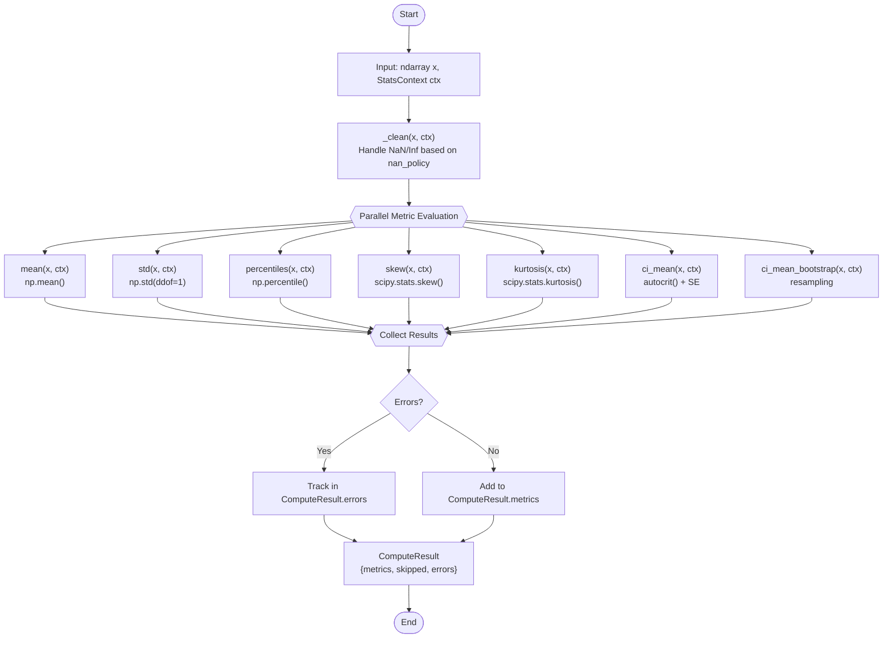
```mermaid
flowchart TB
    Start([Start]) --> Input["Input: ndarray x, StatsContext ctx"]
    Input --> Clean["_clean(x, ctx)<br/>Handle NaN/Inf based on nan_policy"]
    
    Clean --> Fork{{"Parallel Metric Evaluation"}}
    
    Fork --> Mean["mean(x, ctx)<br/>np.mean()"]
    Fork --> Std["std(x, ctx)<br/>np.std(ddof=1)"]
    Fork --> Pct["percentiles(x, ctx)<br/>np.percentile()"]
    Fork --> Skew["skew(x, ctx)<br/>scipy.stats.skew()"]
    Fork --> Kurt["kurtosis(x, ctx)<br/>scipy.stats.kurtosis()"]
    Fork --> CI["ci_mean(x, ctx)<br/>autocrit() + SE"]
    Fork --> Boot["ci_mean_bootstrap(x, ctx)<br/>resampling"]
    
    Mean --> Join{{"Collect Results"}}
    Std --> Join
    Pct --> Join
    Skew --> Join
    Kurt --> Join
    CI --> Join
    Boot --> Join
    
    Join --> Check{"Errors?"}
    Check -->|Yes| Track["Track in ComputeResult.errors"]
    Check -->|No| Success["Add to ComputeResult.metrics"]
    Track --> Result
    Success --> Result
    
    Result["ComputeResult<br/>{metrics, skipped, errors}"]
    Result --> End([End])
```

---

## 6. Module Descriptions

### 6.1 core.py

**Purpose:** Provides the fundamental abstractions for simulation execution.

| Class/Function | Responsibility |
|----------------|----------------|
| `MonteCarloSimulation` | Abstract base class defining the simulation contract |
| `SimulationResult` | Immutable container for outputs and metadata |
| `MonteCarloFramework` | Registry for managing multiple named simulations |
| `make_blocks()` | Utility for partitioning work into chunks |
| `_worker_run_chunk()` | Top-level worker function for process-based parallelism |

### 6.2 stats_engine.py

**Purpose:** Provides statistical analysis capabilities.

| Class/Function | Responsibility |
|----------------|----------------|
| `StatsContext` | Configuration for all statistical computations |
| `StatsEngine` | Orchestrates metric evaluation |
| `ComputeResult` | Holds metrics, skipped, and errors |
| `FnMetric` | Adapter for plain functions to `Metric` protocol |
| `mean`, `std`, `percentiles` | Descriptive statistics |
| `skew`, `kurtosis` | Higher moments |
| `ci_mean`, `ci_mean_bootstrap`, `ci_mean_chebyshev` | Confidence intervals |
| `chebyshev_required_n`, `markov_error_prob` | Distribution-free bounds |
| `bias_to_target`, `mse_to_target` | Target-based metrics |

### 6.3 utils.py

**Purpose:** Provides critical value functions for confidence intervals.

| Function | Responsibility |
|----------|----------------|
| `z_crit(confidence)` | Normal distribution critical value |
| `t_crit(confidence, df)` | Student's t critical value |
| `autocrit(confidence, n, method)` | Auto-select z or t based on sample size |

### 6.4 sims/

**Purpose:** Provides ready-to-use simulation implementations.

| Class | Responsibility |
|-------|----------------|
| `PiEstimationSimulation` | Estimate π via geometric probability |
| `PortfolioSimulation` | Simulate wealth under GBM dynamics |
| `BlackScholesSimulation` | Price European/American options |
| `BlackScholesPathSimulation` | Generate GBM price paths |

---

## 7. Data Flow

### 7.1 Simulation Execution Flow

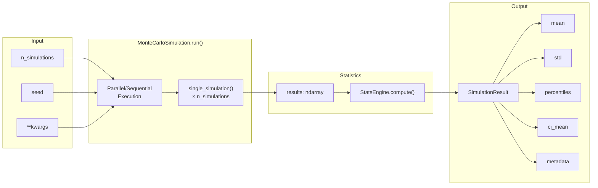
```mermaid
flowchart LR
    subgraph Input
        n["n_simulations"]
        seed["seed"]
        kwargs["**kwargs"]
    end

    subgraph Processing["MonteCarloSimulation.run()"]
        exec["Parallel/Sequential<br/>Execution"]
        single["single_simulation()<br/>× n_simulations"]
    end

    subgraph Stats["Statistics"]
        results["results: ndarray"]
        engine["StatsEngine.compute()"]
    end

    subgraph Output
        sr["SimulationResult"]
        mean["mean"]
        std["std"]
        pct["percentiles"]
        ci["ci_mean"]
        meta["metadata"]
    end

    n & seed & kwargs --> exec
    exec --> single
    single --> results
    results --> engine
    engine --> sr
    sr --> mean & std & pct & ci & meta
```

### 7.2 Statistics Computation Flow

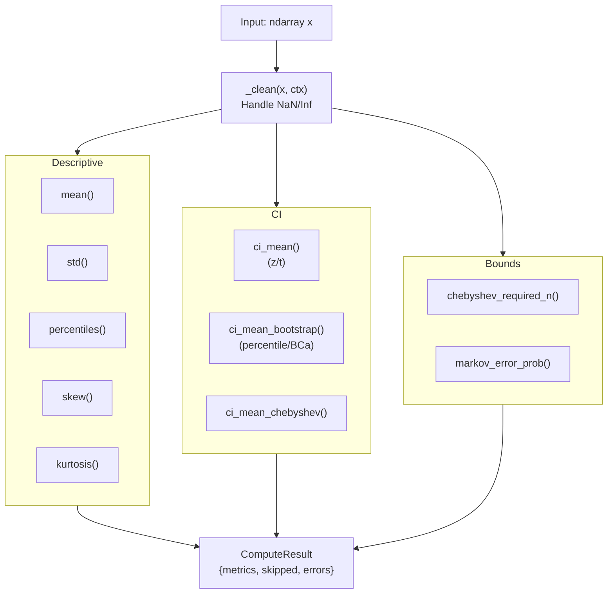
```mermaid
flowchart TB
    Input["Input: ndarray x"] --> Clean["_clean(x, ctx)<br/>Handle NaN/Inf"]
    
    Clean --> Descriptive["Descriptive Stats"]
    Clean --> CI["Confidence Intervals"]
    Clean --> Bounds["Distribution-Free Bounds"]
    
    subgraph Descriptive
        mean_f["mean()"]
        std_f["std()"]
        pct_f["percentiles()"]
        skew_f["skew()"]
        kurt_f["kurtosis()"]
    end
    
    subgraph CI
        ci_mean_f["ci_mean()<br/>(z/t)"]
        ci_boot_f["ci_mean_bootstrap()<br/>(percentile/BCa)"]
        ci_cheb_f["ci_mean_chebyshev()"]
    end
    
    subgraph Bounds
        cheb_n["chebyshev_required_n()"]
        markov["markov_error_prob()"]
    end
    
    Descriptive --> Result
    CI --> Result
    Bounds --> Result
    
    Result["ComputeResult<br/>{metrics, skipped, errors}"]
```

---

## 8. Interface Design

### 8.1 Public API

```python
# Core classes
from mcframework import (
    MonteCarloSimulation,  # ABC for custom simulations
    SimulationResult,       # Result container
    MonteCarloFramework,    # Registry and runner
)

# Statistics
from mcframework import (
    StatsEngine,            # Metric orchestrator
    StatsContext,           # Configuration
    FnMetric,               # Metric adapter
    DEFAULT_ENGINE,         # Pre-built engine
)

# Utilities
from mcframework import z_crit, t_crit, autocrit

# Built-in simulations
from mcframework import (
    PiEstimationSimulation,
    PortfolioSimulation,
    BlackScholesSimulation,
    BlackScholesPathSimulation,
)
```

### 8.2 Usage Examples

**Minimal Custom Simulation:**
```python
from mcframework import MonteCarloSimulation

class DiceSimulation(MonteCarloSimulation):
    def single_simulation(self, _rng=None, n_dice=2):
        rng = self._rng(_rng, self.rng)
        return float(rng.integers(1, 7, size=n_dice).sum())

sim = DiceSimulation(name="2d6")
sim.set_seed(42)
result = sim.run(10_000, parallel=True)
print(result.mean)  # ~7.0
```

**Using the Framework:**
```python
from mcframework import MonteCarloFramework, PiEstimationSimulation

fw = MonteCarloFramework()
fw.register_simulation(PiEstimationSimulation())
result = fw.run_simulation("Pi Estimation", 100_000, n_points=10_000)
print(result.result_to_string())
```

**Custom Statistics Configuration:**
```python
from mcframework import StatsContext

ctx = StatsContext(
    n=10000,
    confidence=0.99,
    ci_method="bootstrap",
    n_bootstrap=5000,
    nan_policy="omit"
)
```

---

## Appendix: Metrics Reference

| Metric Function | Output Type | Category |
|-----------------|-------------|----------|
| `mean(x, ctx)` | `float` | Descriptive |
| `std(x, ctx)` | `float` | Descriptive |
| `percentiles(x, ctx)` | `dict[int, float]` | Descriptive |
| `skew(x, ctx)` | `float` | Descriptive |
| `kurtosis(x, ctx)` | `float` | Descriptive |
| `ci_mean(x, ctx)` | `dict` | Confidence Interval |
| `ci_mean_bootstrap(x, ctx)` | `dict` | Confidence Interval |
| `ci_mean_chebyshev(x, ctx)` | `dict` | Distribution-Free |
| `chebyshev_required_n(x, ctx)` | `int` | Sample Sizing |
| `markov_error_prob(x, ctx)` | `float` | Error Bound |
| `bias_to_target(x, ctx)` | `float` | Target-Based |
| `mse_to_target(x, ctx)` | `float` | Target-Based |
