# System Design

## System and Program Design

### McFramework — Monte Carlo Simulation Framework

> *For requirements, stakeholders, and project plan, see [PROJECT_PLAN.md](PROJECT_PLAN.md)*

---

## Table of Contents

1. [System Overview](#1-system-overview)
2. [Architectural Design](#2-architectural-design)
3. [Design Patterns](#3-design-patterns)
4. [UML Diagrams](#4-uml-diagrams)
5. [Data Flow](#5-data-flow)
6. [Interface Design](#6-interface-design)

---

## 1. System Overview

### 1.1 System Context Diagram

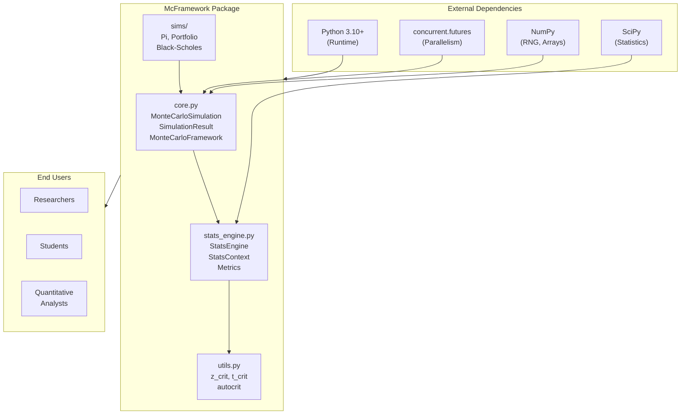

### 1.2 Package Structure

```
mcframework/
├── __init__.py          # Public API exports
├── core.py              # MonteCarloSimulation, SimulationResult, MonteCarloFramework
├── stats_engine.py      # StatsEngine, StatsContext, ComputeResult, metrics
├── utils.py             # z_crit, t_crit, autocrit
└── sims/
    ├── __init__.py      # Simulation catalog
    ├── pi.py            # PiEstimationSimulation
    ├── portfolio.py     # PortfolioSimulation
    └── black_scholes.py # BlackScholesSimulation, BlackScholesPathSimulation
```

---

## 2. Architectural Design

### 2.1 Layered Architecture

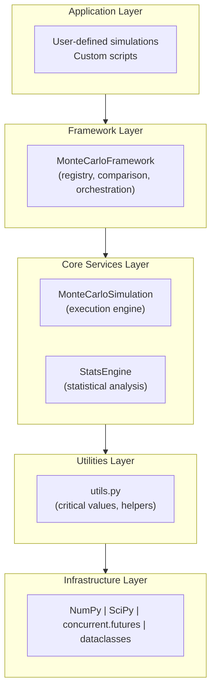

### 2.2 Component Diagram

```mermaid
flowchart TB
    subgraph mcframework["mcframework package"]
        subgraph core_comp["<<component>> core"]
            MCS["MonteCarloSimulation<br/><<abstract>>"]
            SR["SimulationResult<br/><<dataclass>>"]
            MCF["MonteCarloFramework"]
        end

        subgraph stats_comp["<<component>> stats_engine"]
            SE["StatsEngine"]
            SC["StatsContext<br/><<dataclass>>"]
            CR["ComputeResult<br/><<dataclass>>"]
            FM["FnMetric<<generic>>"]
            MP["Metric<<protocol>>"]
        end

        subgraph utils_comp["<<component>> utils"]
            zcrit["z_crit()"]
            tcrit["t_crit()"]
            auto["autocrit()"]
        end

        subgraph sims_comp["<<component>> sims"]
            pi["PiEstimationSimulation"]
            port["PortfolioSimulation"]
            bs["BlackScholesSimulation"]
        end
    end

    core_comp -->|uses| stats_comp
    core_comp -->|uses| utils_comp
    stats_comp -->|uses| utils_comp
    sims_comp -->|extends| core_comp
```

### 2.3 Process View (Parallel Execution)

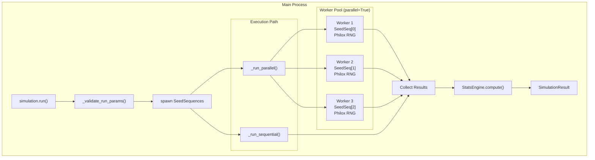

---

## 3. Design Patterns

### 3.1 Template Method Pattern

**Location:** `MonteCarloSimulation.run()`

**Purpose:** Define the skeleton of the simulation algorithm, deferring specific steps to subclasses.

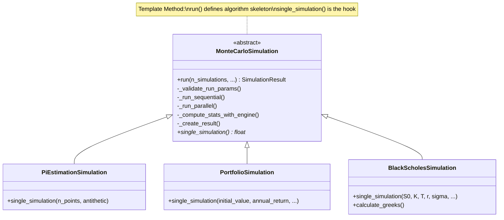

### 3.2 Strategy Pattern

**Location:** `StatsEngine` with `Metric` protocol

**Purpose:** Define a family of algorithms (metrics), encapsulate each one, and make them interchangeable.

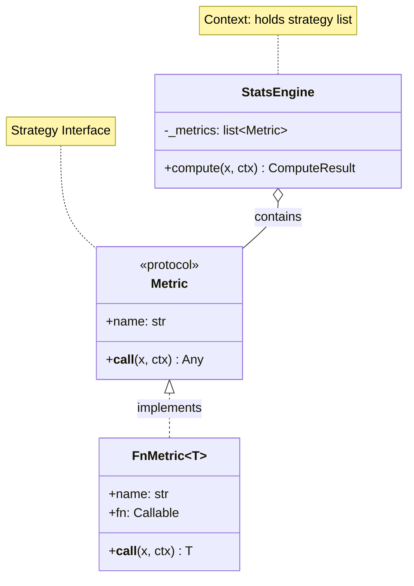

### 3.3 Registry Pattern

**Location:** `MonteCarloFramework`

**Purpose:** Maintain a collection of named simulations for lookup and comparison.

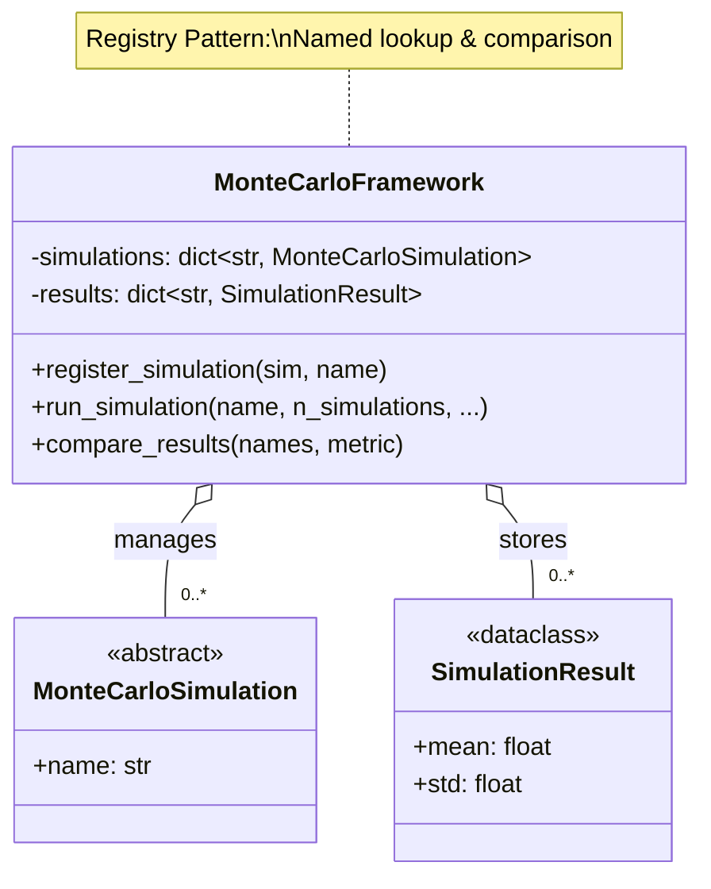

### 3.4 Adapter Pattern

**Location:** `FnMetric`

**Purpose:** Convert a plain function into an object implementing the `Metric` protocol.

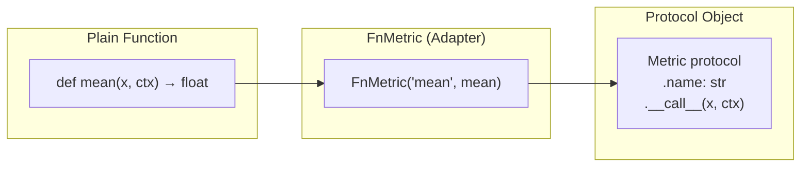

### 3.5 Pattern Summary

| Pattern | Location | Benefit |
|---------|----------|---------|
| **Template Method** | `MonteCarloSimulation.run()` | Reuse execution logic, customize only simulation |
| **Strategy** | `StatsEngine` + `Metric` | Pluggable metrics without changing engine |
| **Registry** | `MonteCarloFramework` | Named lookup and comparison |
| **Builder** | `StatsContext.with_overrides()` | Fluent configuration |
| **Adapter** | `FnMetric` | Convert functions to protocol objects |

---

## 4. UML Diagrams

### 4.1 Class Diagram (Core Module)

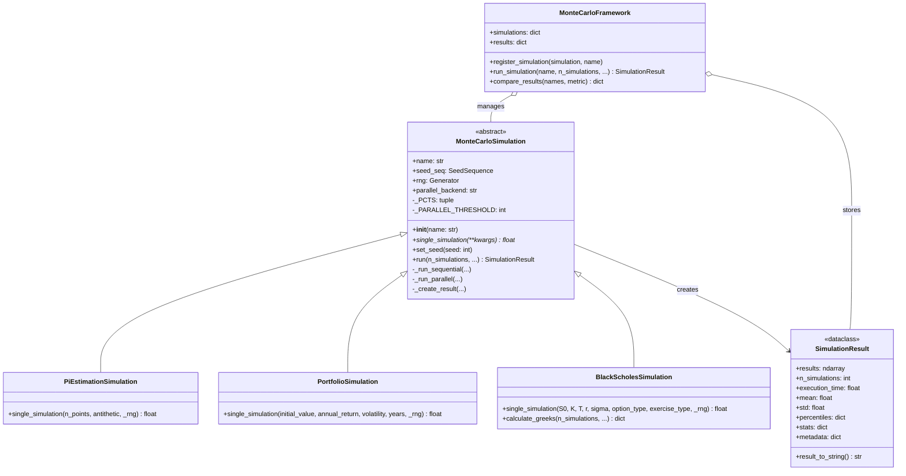

### 4.2 Class Diagram (Stats Engine Module)

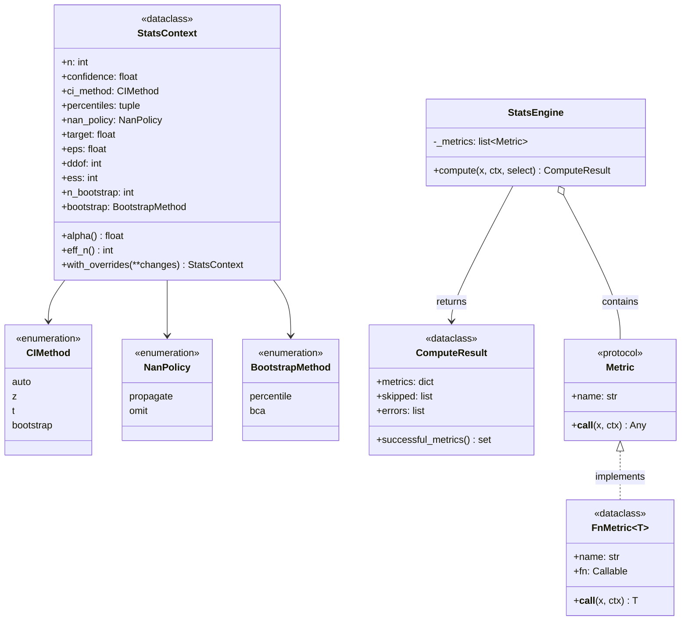

### 4.3 Sequence Diagram: Running a Simulation

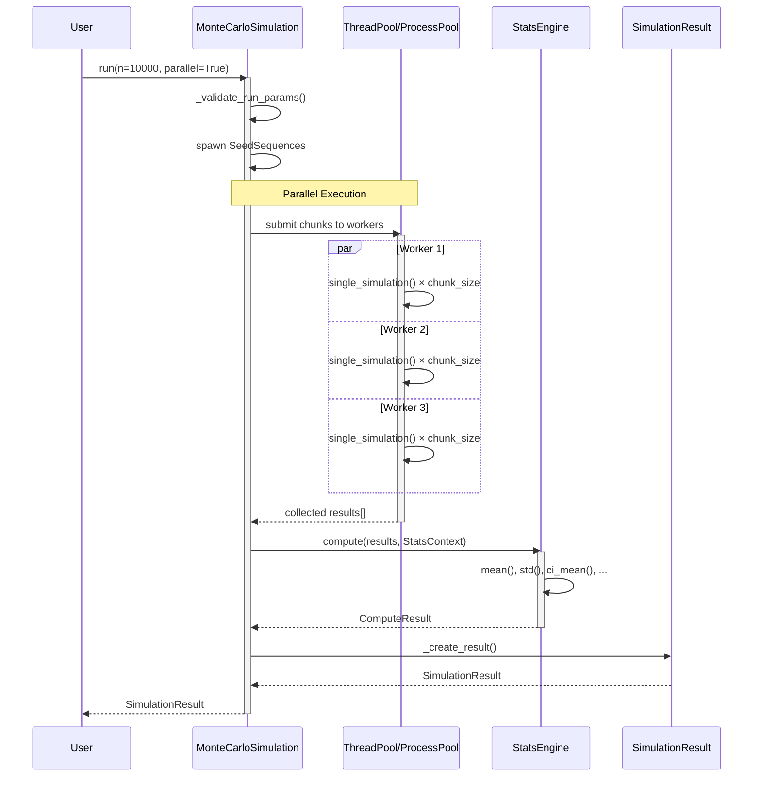

### 4.4 Sequence Diagram: Bootstrap Confidence Interval

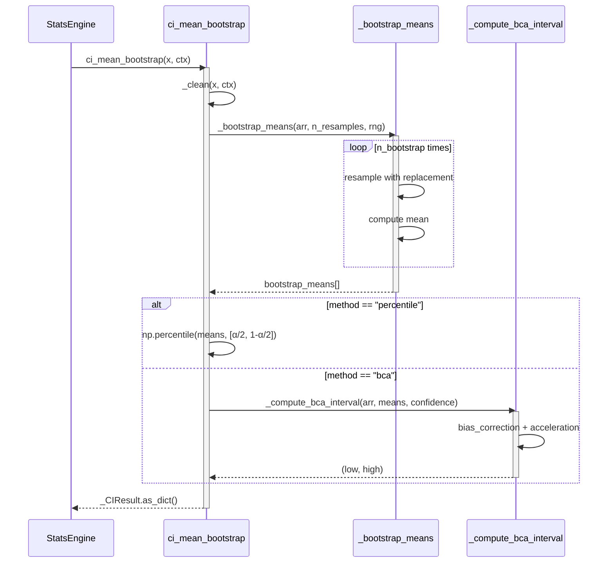

### 4.5 State Diagram: Simulation Lifecycle

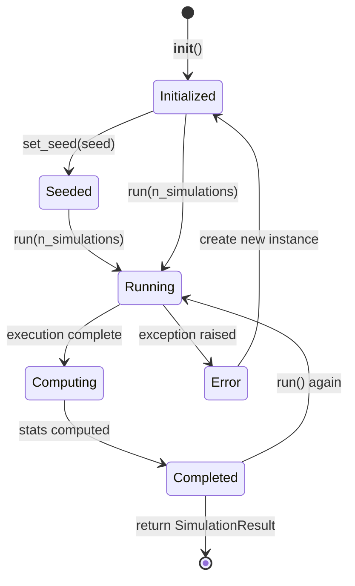

---

## 5. Data Flow

### 5.1 Simulation Execution Flow

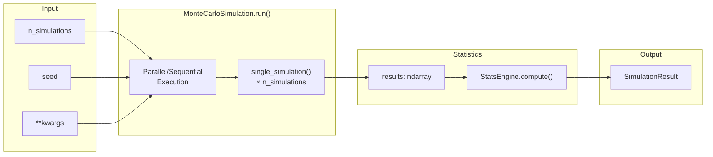

### 5.2 Statistics Computation Flow

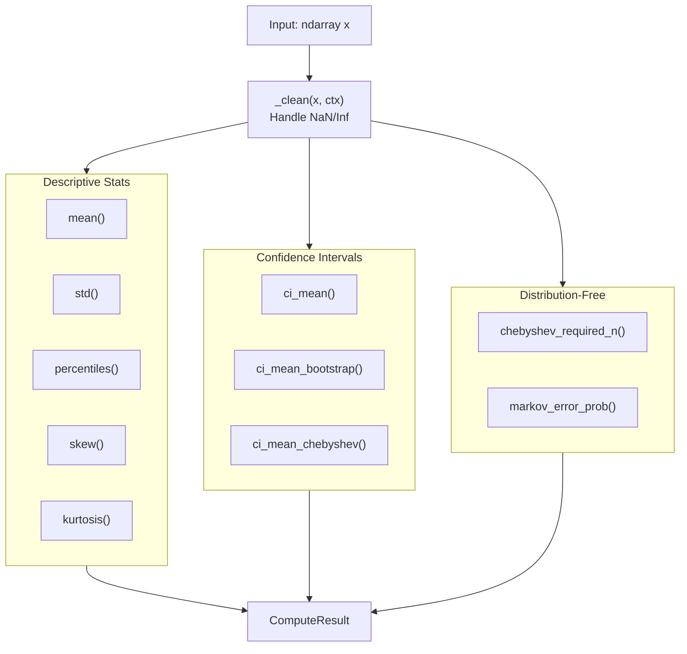

---

## 6. Interface Design

### 6.1 Public API

```python
# Core classes
from mcframework import (
    MonteCarloSimulation,  # ABC for custom simulations
    SimulationResult,       # Result container
    MonteCarloFramework,    # Registry and runner
)

# Statistics
from mcframework import (
    StatsEngine,            # Metric orchestrator
    StatsContext,           # Configuration
    FnMetric,               # Metric adapter
    DEFAULT_ENGINE,         # Pre-built engine
)

# Utilities
from mcframework import z_crit, t_crit, autocrit

# Built-in simulations
from mcframework import (
    PiEstimationSimulation,
    PortfolioSimulation,
    BlackScholesSimulation,
    BlackScholesPathSimulation,
)
```

### 6.2 Usage Examples

**Minimal Custom Simulation:**

```python
from mcframework import MonteCarloSimulation

class DiceSimulation(MonteCarloSimulation):
    def single_simulation(self, _rng=None, n_dice=2):
        rng = self._rng(_rng, self.rng)
        return float(rng.integers(1, 7, size=n_dice).sum())

sim = DiceSimulation(name="2d6")
sim.set_seed(42)
result = sim.run(10_000, parallel=True)
print(result.mean)  # ~7.0
```

**Using the Framework:**

```python
from mcframework import MonteCarloFramework, PiEstimationSimulation

fw = MonteCarloFramework()
fw.register_simulation(PiEstimationSimulation())
result = fw.run_simulation("Pi Estimation", 100_000, n_points=10_000)
print(result.result_to_string())
```

---

## Appendix: Module Reference

| Module | Classes/Functions | Purpose |
|--------|-------------------|---------|
| `core.py` | `MonteCarloSimulation`, `SimulationResult`, `MonteCarloFramework` | Simulation execution |
| `stats_engine.py` | `StatsEngine`, `StatsContext`, `ComputeResult`, `FnMetric`, 12+ metric functions | Statistical analysis |
| `utils.py` | `z_crit`, `t_crit`, `autocrit` | Critical values |
| `sims/pi.py` | `PiEstimationSimulation` | π estimation |
| `sims/portfolio.py` | `PortfolioSimulation` | GBM wealth |
| `sims/black_scholes.py` | `BlackScholesSimulation`, `BlackScholesPathSimulation` | Option pricing |
