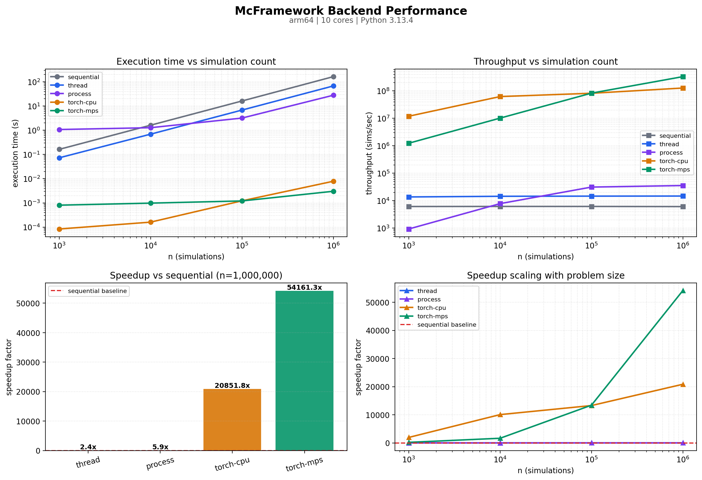

# Backend Benchmarking

A simulation framework is only as compelling as the speedups it can demonstrate.
`mcframework` makes "how fast is each backend on my workload?" a first-class, repeatable
operation: {func}`~mcframework.benchmark.run_suite` times the same Monte Carlo workload
across every available execution backend and returns a structured, plottable,
JSON-serializable report.

## The idea: the backend matrix is data

Each backend is described by a {class}`~mcframework.benchmark.BackendSpec` — a label, the
`run()` backend string, and a Torch device. {func}`~mcframework.benchmark.default_backends`
assembles the device-aware default set: the CPU backends are always included, while the
Torch CPU, Apple-Silicon MPS, and NVIDIA CUDA backends are added **only when their device
is actually available**. A run therefore never advertises a backend it cannot execute.

Because the matrix is data rather than code, adding a new accelerator later (CUDA is the
next milestone) is a single extra spec plus a device gate — not a new benchmark script.

The measurement core depends only on NumPy. Plotting lives in
{func}`~mcframework.benchmark.plot_benchmarks`, which imports `matplotlib` lazily, so the
plotting dependency stays optional (`pip install mcframework[viz]`).

## Quick start

```python
from mcframework import PiEstimationSimulation, run_suite, default_backends
from mcframework.benchmark import plot_benchmarks

sim = PiEstimationSimulation()
report = run_suite(sim, [1_000, 10_000, 100_000, 1_000_000], default_backends())

print(report.summary_table())   # execution-time + speedup table (N/A for gaps)
fig = plot_benchmarks(report)    # four-panel performance figure
data = report.to_dict()          # JSON-serializable artifact
```

`run_suite` warms up each backend once (to prime process pools, JIT, and caches), then
times the full `sizes × specs` grid. Each cell runs through
{func}`~mcframework.benchmark.benchmark_run`, which calls `sim.run(..., compute_stats=False)`
so timings reflect pure sampling throughput, not statistics.

## Reducing noise: best-of-N

Wall-clock timings wobble with scheduler and GC noise. Pass `repeats=N` to run each cell
`N` times and keep the **best (minimum)** time — the standard denoiser for microbenchmarks:

```python
report = run_suite(sim, [100_000, 1_000_000], default_backends(), repeats=5)
```

```{note}
Best-of-N captures *throughput*, not variance or per-operator cost. For kernel-level
detail (per-op timings, traces), reach for {mod}`mcframework.profiling`.
```

## Keeping large runs fast: quick mode

The sequential backend is O(n) and dominates wall time at large sizes. `quick=True` skips
the sequential backend above `max_sequential_size` so a big sweep stays fast while still
measuring the parallel and GPU backends at full scale:

```python
report = run_suite(
    sim, [1_000, 100_000, 10_000_000], default_backends(),
    quick=True, max_sequential_size=1_000_000,
)
```

The summary table and speedups are **N/A-aware**: a backend missing a cell (skipped, or
failed because its device is unavailable) simply reads `N/A` instead of crashing the run.

## The report

A {class}`~mcframework.benchmark.BenchmarkReport` collects every measured
{class}`~mcframework.benchmark.BenchmarkResult` plus the {func}`~mcframework.benchmark.system_info`
captured at run time. Useful methods:

| Method | Returns |
| --- | --- |
| `by_backend()` | results grouped by backend, sorted by size |
| `speedups(baseline="sequential")` | `(n, factor)` pairs relative to a baseline |
| `summary_table()` | fixed-width execution-time + speedup table |
| `best(n=None)` | fastest result at a given size (default: largest) |
| `to_dict()` | JSON-serializable dict (system info, sizes, rows) |

## Command line

The library ships a console entry point — the demo
(`demos/demo_backend_benchmark.py`) is just a thin wrapper over it:

```bash
# Quick headless run that saves a figure and a JSON artifact:
mcframework-benchmark --quick --save backend_benchmark.png --json report.json --no-show

# Custom sizes, more repeats, exclude MPS:
mcframework-benchmark --sizes 1000,10000,100000 --repeats 5 --no-mps
```

Key flags: `--quick`, `--sizes`, `--repeats`, `--max-sequential-size`, `--no-mps`,
`--save PATH`, `--json PATH`, `--no-show`.

## The benchmark figure

`plot_benchmarks` renders four panels in a clean, light aesthetic: execution time vs `n`
(log-log), throughput vs `n` (log-log), a speedup bar chart at the largest common size,
and speedup scaling with problem size against the sequential baseline.

```bash
MPLBACKEND=Agg python demos/demo_backend_benchmark.py --quick --save backend_benchmark.png
```



```{seealso}
{doc}`../api/_modules/benchmark` for the full API reference.
```
