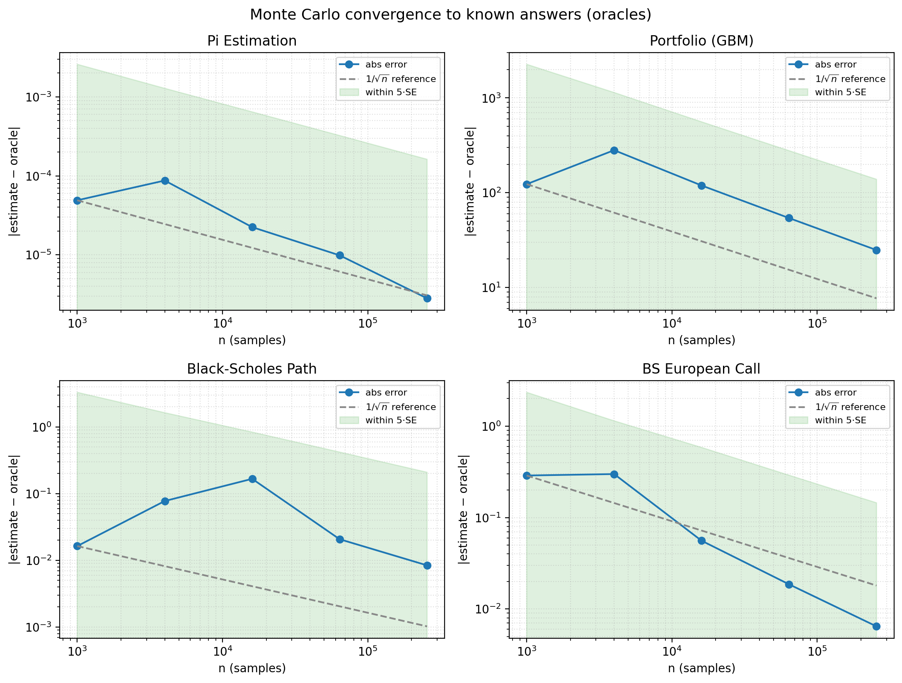

# Oracles and Benchmarks

A Monte Carlo estimate is only trustworthy if you can check it. `mcframework` makes
"converges to a known answer" a first-class, repeatable operation: when a simulation
has a closed-form answer, it declares that answer as an **oracle**, and
{func}`~mcframework.validation.validate_convergence` asserts the estimate lands on it.

## The idea: oracle = checkable ground truth

An *oracle* is a value you already know to be correct: the analytic expectation of a
single draw. If the Monte Carlo mean does not converge to the oracle, the estimator is
wrong — full stop. This turns correctness into a test instead of a vibe.

`mcframework` reuses machinery it already has. The oracle is passed straight through to
the stats engine as the context `target` (via `run(extra_context={"target": oracle})`),
which also populates `bias_to_target` / `mse_to_target` for free. Validation is a thin
pass/fail layer over the confidence interval the engine already computes.

Two complementary checks are reported:

- **`within_ci`** — the oracle lies inside the computed confidence interval.
- **`within_tol`** — the absolute error is within `sigma_tol` standard errors:

```math
\left| \widehat{\theta}_n - \theta \right| \le k \cdot \mathrm{SE},
\qquad \mathrm{SE} = \frac{s}{\sqrt{n}}, \quad k = \texttt{sigma\_tol}.
```

`within_tol` at a fixed seed is the recommended CI gate: it is statistically principled,
essentially never flaky (a $5\sigma$ false failure is a ~1-in-1.7-million event), yet a real
implementation bug lands many standard errors away and fails loudly.

## Quick start

```python
from mcframework import validate_convergence, BlackScholesSimulation

report = validate_convergence(BlackScholesSimulation(), 50_000, seed=0, option_type="call")
print(report.status)      # "pass"
print(report.estimate)    # Monte Carlo price
print(report.oracle)      # closed-form Black-Scholes-Merton price
print(report.abs_error)   # within a few standard errors
```

If a simulation declares no oracle, no run is performed and `status` is `"no-oracle"` —
a deliberate signal that the simulation is research, not a verifiable demo:

```python
report = validate_convergence(BlackScholesSimulation(), 1_000, exercise_type="american")
assert report.status == "no-oracle"   # American options have no closed form
```

## Built-in oracles

These ship validated and are pinned by `tests/test_oracles.py`:

| Simulation | Oracle | Reference |
| --- | --- | --- |
| {class}`~mcframework.sims.PiEstimationSimulation` | $\pi$ | Closed form: $4\,\Pr(X^2+Y^2\le 1)=\pi$ |
| {class}`~mcframework.sims.PortfolioSimulation` (GBM) | $V_0 e^{\mu T}$ | Risk-neutral GBM expectation |
| {class}`~mcframework.sims.BlackScholesPathSimulation` | $S_0 e^{rT}$ | Risk-neutral GBM terminal price |
| {class}`~mcframework.sims.BlackScholesSimulation` (European) | $C, P$ | Black-Scholes-Merton (1973) |
| {class}`~mcframework.sims.BlackScholesSimulation` (American) | *none* | No closed form → not validated |

The Black-Scholes-Merton closed form for a European option is

```math
C = S_0\,\Phi(d_1) - K e^{-rT}\,\Phi(d_2), \qquad
P = K e^{-rT}\,\Phi(-d_2) - S_0\,\Phi(-d_1),
```

with $d_1 = \dfrac{\ln(S_0/K) + (r + \tfrac12\sigma^2)T}{\sigma\sqrt T}$ and
$d_2 = d_1 - \sigma\sqrt T$.

## Adding an oracle to your own simulation

Override {meth}`~mcframework.core.MonteCarloSimulation.analytic_reference` to return the
known expected value of a single draw under the given parameters, and set
`reference_source` to cite it. Return `None` when no oracle exists.

```python
import math
from mcframework import MonteCarloSimulation, validate_convergence

class CoinFlipSimulation(MonteCarloSimulation):
    reference_source = "Closed form: E[Bernoulli(p)] = p"

    def __init__(self, p: float = 0.5):
        super().__init__("Coin Flip")
        self.p = p

    def single_simulation(self, _rng=None, **kwargs):
        rng = self._rng(_rng, self.rng)
        return float(rng.random() < self.p)

    def analytic_reference(self, **params):
        return self.p

report = validate_convergence(CoinFlipSimulation(0.3), 100_000, seed=0)
assert report.status == "pass"
```

`analytic_reference` receives the same keyword parameters as `run` / `single_simulation`,
so the oracle can depend on configuration (strike, drift, etc.). Keep the reference a
genuine closed form or a cited benchmark — never a second Monte Carlo estimate.

## Kinds of reference

Not every credible reference is a closed form. Set `reference_kind` to record which
flavour of ground truth you are checking against; it is surfaced on every
{class}`~mcframework.validation.ConvergenceReport`:

| `reference_kind` | Meaning | Example |
| --- | --- | --- |
| `"closed-form"` | An exact analytic answer | Black-Scholes-Merton price; $V_0 e^{\mu T}$ |
| `"benchmark"` | A published, cited reference value | A criticality benchmark $k_\text{eff}$ from a standard suite |
| `"limit"` | A known asymptotic / limiting value | A large-$n$ or zero-variance limit |

A `"benchmark"` reference lets a domain simulation be validated even when no closed form
exists: `analytic_reference` returns the published constant and `reference_source`
carries the citation. The validation machinery is identical — only the provenance of the
oracle differs.

## Promoting a simulation out of draft

> **Rule:** a simulation may not leave *draft* status (be advertised as production-ready,
> added to the built-in gallery, or recommended in docs) until it has **either an
> analytic oracle or a cited benchmark**, wired through `analytic_reference` and pinned
> by a convergence test in `tests/test_oracles.py`.

This is the governance signal the whole system exists to provide. A simulation with no
checkable ground truth is research: keep `analytic_reference` returning `None` (its
reports read `no-oracle`) and label it as draft until a reference exists.

### Benchmark template

When there is no closed form, validate against a published benchmark in three steps:

1. **Cite the source.** Put the full reference in `reference_source` and set
   `reference_kind = "benchmark"`.
2. **Reproduce the value.** Have `analytic_reference` return the published constant for
   the matching parameters (and `None` for any configuration the benchmark does not
   cover).
3. **Show convergence.** Add a `tests/test_oracles.py` case asserting
   `validate_convergence(...).within_tol` at a fixed seed, and (optionally) add the sim
   to the convergence gallery.

#### Worked example: reactor-physics criticality (not implemented here)

A neutron-transport simulation has no elementary closed form, but the field publishes
*criticality benchmarks* — configurations with an accepted reference $k_\text{eff}$
(e.g. the ICSBEP handbook, or an analytic infinite-medium $k_\infty = \nu\Sigma_f /
\Sigma_a$). The pattern would be:

```python
class CriticalityBenchmarkSim(MonteCarloSimulation):
    reference_source = "ICSBEP HEU-MET-FAST-001 (Godiva), k_eff = 1.0000 +/- 0.0010"
    reference_kind = "benchmark"

    def analytic_reference(self, *, config="godiva", **params):
        return 1.0000 if config == "godiva" else None  # only the cited config

    def single_simulation(self, _rng=None, **kwargs):
        ...  # neutron transport estimating k_eff
```

`mcframework` ships **no** neutron-transport implementation: that remains a separate
domain effort. What it now provides is the gate — such a simulation is only credible
once its `k_eff` estimate is shown to converge to the cited benchmark.

## The convergence gallery

`demos/demo_convergence_gallery.py` sweeps every oracle-backed simulation over
increasing sample sizes and renders the result two ways: a Markdown convergence table
and a log-log error-vs-`n` plot. The absolute error tracks the theoretical
$1/\sqrt{n}$ rate and stays inside the `5·SE` pass band — correctness you can see.

```bash
# Full sweep (interactive), or headless with a saved figure:
python demos/demo_convergence_gallery.py
MPLBACKEND=Agg python demos/demo_convergence_gallery.py --quick --save gallery.png
```



```{seealso}
{doc}`../api/_modules/validation` for the full API reference.
```
