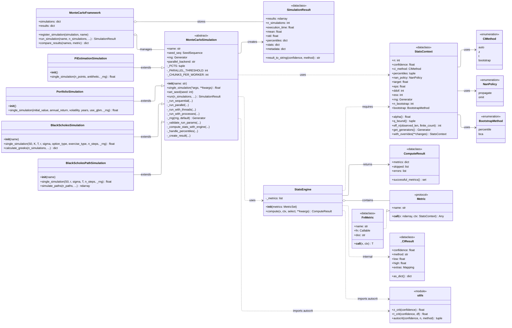
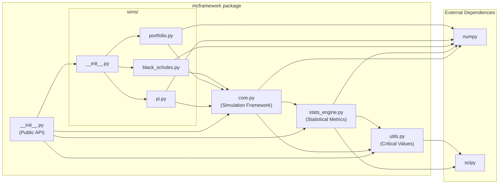
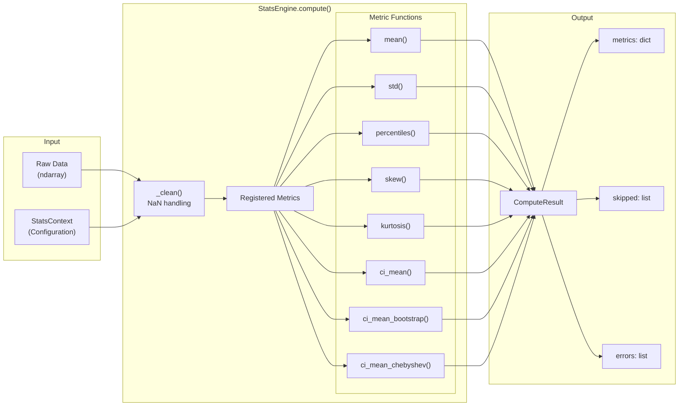
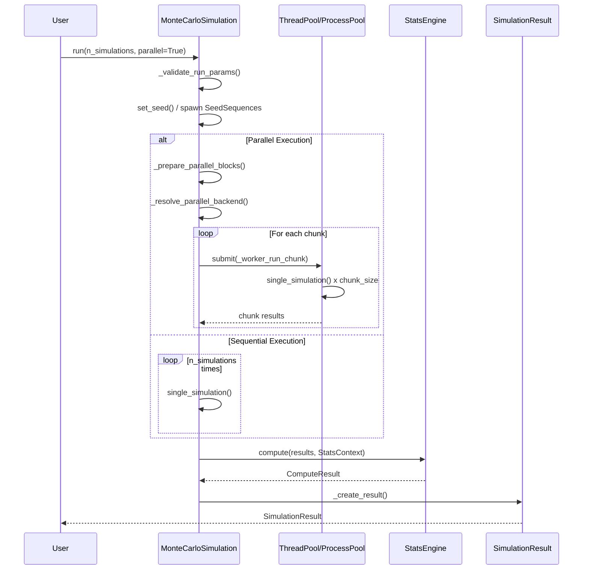

# McFramework UML Class Diagram

## Package Overview

```mermaid
---
config:
  layout: elk
---
classDiagram
direction LR
    class MonteCarloSimulation {
	    +name: str
	    +seed_seq: SeedSequence
	    +rng: Generator
	    +parallel_backend: str
	    -_PCTS: tuple
	    -_PARALLEL_THRESHOLD: int
	    -_CHUNKS_PER_WORKER: int
	    +__init__(name: str)
	    +single_simulation(*args, **kwargs) float*
	    +set_seed(seed: int)
	    +run(n_simulations, ...) SimulationResult
	    -_run_sequential(...)
	    -_run_parallel(...)
	    -_run_with_threads(...)
	    -_run_with_processes(...)
	    -_rng(rng, default) Generator
	    -_validate_run_params(...)
	    -_compute_stats_with_engine(...)
	    -_handle_percentiles(...)
	    -_create_result(...)
    }

    class SimulationResult {
	    +results: ndarray
	    +n_simulations: int
	    +execution_time: float
	    +mean: float
	    +std: float
	    +percentiles: dict
	    +stats: dict
	    +metadata: dict
	    +result_to_string(confidence, method) str
    }

    class MonteCarloFramework {
	    +simulations: dict
	    +results: dict
	    +register_simulation(simulation, name)
	    +run_simulation(name, n_simulations, ...) SimulationResult
	    +compare_results(names, metric) dict
    }

    class StatsContext {
	    +n: int
	    +confidence: float
	    +ci_method: CIMethod
	    +percentiles: tuple
	    +nan_policy: NanPolicy
	    +target: float
	    +eps: float
	    +ddof: int
	    +ess: int
	    +rng: Generator
	    +n_bootstrap: int
	    +bootstrap: BootstrapMethod
	    +alpha() float
	    +q_bound() tuple
	    +eff_n(observed_len, finite_count) int
	    +get_generators() Generator
	    +with_overrides(**changes) StatsContext
    }

    class ComputeResult {
	    +metrics: dict
	    +skipped: list
	    +errors: list
	    +successful_metrics() set
    }

    class StatsEngine {
	    -_metrics: list
	    +__init__(metrics: MetricSet)
	    +compute(x, ctx, select, **kwargs) ComputeResult
    }

    class Metric {
	    +name: str
	    +__call__(x: ndarray, ctx: StatsContext) Any
    }

    class FnMetric {
	    +name: str
	    +fn: Callable
	    +doc: str
	    +__call__(x, ctx) T
    }

    class _CIResult {
	    +confidence: float
	    +method: str
	    +low: float
	    +high: float
	    +extras: Mapping
	    +as_dict() dict
    }

    class CIMethod {
	    auto
	    z
	    t
	    bootstrap
    }

    class NanPolicy {
	    propagate
	    omit
    }

    class BootstrapMethod {
	    percentile
	    bca
    }

    class PiEstimationSimulation {
	    +__init__()
	    +single_simulation(n_points, antithetic, _rng) float
    }

    class PortfolioSimulation {
	    +__init__()
	    +single_simulation(initial_value, annual_return, volatility, years, use_gbm, _rng) float
    }

    class BlackScholesSimulation {
	    +__init__(name)
	    +single_simulation(S0, K, T, r, sigma, option_type, exercise_type, n_steps, _rng) float
	    +calculate_greeks(n_simulations, ...) dict
    }

    class BlackScholesPathSimulation {
	    +__init__(name)
	    +single_simulation(S0, r, sigma, T, n_steps, _rng) float
	    +simulate_paths(n_paths, ...) ndarray
    }

    class utils {
	    +z_crit(confidence) float
	    +t_crit(confidence, df) float
	    +autocrit(confidence, n, method) tuple
    }

	<<abstract>> MonteCarloSimulation
	<<dataclass>> SimulationResult
	<<dataclass>> StatsContext
	<<dataclass>> ComputeResult
	<<protocol>> Metric
	<<dataclass>> FnMetric
	<<dataclass>> _CIResult
	<<enumeration>> CIMethod
	<<enumeration>> NanPolicy
	<<enumeration>> BootstrapMethod
	<<module>> utils

    PiEstimationSimulation --|> MonteCarloSimulation : extends
    PortfolioSimulation --|> MonteCarloSimulation : extends
    BlackScholesSimulation --|> MonteCarloSimulation : extends
    BlackScholesPathSimulation --|> MonteCarloSimulation : extends
    FnMetric ..|> Metric
    MonteCarloFramework o-- MonteCarloSimulation : manages
    MonteCarloFramework o-- SimulationResult : stores
    MonteCarloSimulation --> SimulationResult : creates
    StatsEngine o-- Metric : contains
    StatsEngine --> ComputeResult : returns
    MonteCarloSimulation ..> StatsEngine : uses
    MonteCarloSimulation ..> StatsContext : uses
    StatsEngine ..> StatsContext : requires
    StatsContext --> CIMethod : uses
    StatsContext --> NanPolicy : uses
    StatsContext --> BootstrapMethod : uses
    StatsEngine ..> _CIResult : internal
    MonteCarloSimulation ..> utils : imports autocrit
    StatsEngine ..> utils : imports autocrit
```

## Module Dependency Graph

```mermaid
flowchart LR

    subgraph mcframework["mcframework package"]
        init["__init__.py<br/>(Public API)"]
        core["core.py<br/>(Simulation Framework)"]
        stats["stats_engine.py<br/>(Statistical Metrics)"]
        utils_mod["utils.py<br/>(Critical Values)"]
        
        subgraph sims["sims/"]
            sims_init["__init__.py"]
            pi["pi.py"]
            portfolio["portfolio.py"]
            bs["black_scholes.py"]
        end
    end

    subgraph external["External Dependencies"]
        numpy["numpy"]
        scipy["scipy"]
    end

    init --> core
    init --> sims_init
    init --> stats
    init --> utils_mod
    
    core --> stats
    core --> utils_mod
    stats --> utils_mod
    
    sims_init --> pi
    sims_init --> portfolio
    sims_init --> bs
    
    pi --> core
    portfolio --> core
    bs --> core
    
    core --> numpy
    stats --> numpy
    stats --> scipy
    utils_mod --> scipy
    bs --> numpy
    pi --> numpy
    portfolio --> numpy
```

## Statistics Engine Flow

```mermaid
flowchart LR
    subgraph Input
        data["Raw Data<br/>(ndarray)"]
        ctx["StatsContext<br/>(Configuration)"]
    end
    
    subgraph Engine["StatsEngine.compute()"]
        clean["_clean()<br/>NaN handling"]
        metrics["Registered Metrics"]
        
        subgraph MetricFuncs["Metric Functions"]
            mean_fn["mean()"]
            std_fn["std()"]
            pct_fn["percentiles()"]
            skew_fn["skew()"]
            kurt_fn["kurtosis()"]
            ci_fn["ci_mean()"]
            boot_fn["ci_mean_bootstrap()"]
            cheb_fn["ci_mean_chebyshev()"]
        end
    end
    
    subgraph Output
        result["ComputeResult"]
        m["metrics: dict"]
        s["skipped: list"]
        e["errors: list"]
    end
    
    data --> clean
    ctx --> clean
    clean --> metrics
    metrics --> mean_fn & std_fn & pct_fn
    mean_fn & std_fn & pct_fn --> result
    metrics --> skew_fn & kurt_fn & ci_fn
    skew_fn & kurt_fn & ci_fn --> result
    metrics --> boot_fn & cheb_fn
    boot_fn & cheb_fn --> result
    result --> m & s & e
```

## Simulation Execution Flow

```mermaid
sequenceDiagram
    participant User
    participant Sim as MonteCarloSimulation
    participant Executor as ThreadPool/ProcessPool
    participant Engine as StatsEngine
    participant Result as SimulationResult

    User->>Sim: run(n_simulations, parallel=True)
    Sim->>Sim: _validate_run_params()
    Sim->>Sim: set_seed() / spawn SeedSequences
    
    alt Parallel Execution
        Sim->>Sim: _prepare_parallel_blocks()
        Sim->>Sim: _resolve_parallel_backend()
        loop For each chunk
            Sim->>Executor: submit(_worker_run_chunk)
            Executor->>Executor: single_simulation() x chunk_size
            Executor-->>Sim: chunk results
        end
    else Sequential Execution
        loop n_simulations times
            Sim->>Sim: single_simulation()
        end
    end
    
    Sim->>Engine: compute(results, StatsContext)
    Engine-->>Sim: ComputeResult
    Sim->>Result: _create_result()
    Result-->>User: SimulationResult
```

